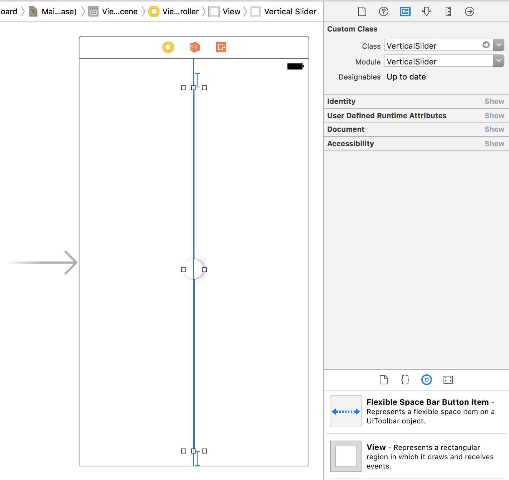
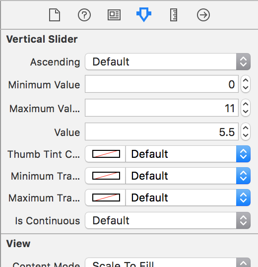

# 🎚VerticalSlider

[](http://cocoapods.org/pods/VerticalSlider)
[](http://cocoapods.org/pods/VerticalSlider)
[](http://cocoapods.org/pods/VerticalSlider)

**If you like VerticalSlider, give it a ★ at the top right of this page.**
> Hi, I'm Jon Kent and I am an iOS designer, developer, and mobile strategist. I love coffee and play the drums.
> * [**Hire me**](mailto:yo@massappeal.co?subject=Let's%20build%20something%20amazing) to help you make cool stuff. *Note: If you're having a problem with VerticalSlider, please open an [issue](https://github.com/jonkykong/VerticalSlider/issues/new) and do not email me.*
> * Check out my [website](http://massappeal.co) to see some of my other projects.
> * Building and maintaining this free library takes time. Help keep me awake and buy me a coffee ☕️ via [PayPal](https://www.paypal.com/cgi-bin/webscr?cmd=_donations&business=contact%40jonkent%2eme&lc=US&currency_code=USD&bn=PP%2dDonationsBF%3abtn_donateCC_LG%2egif%3aNonHosted).

## Overview
VerticalSlider is a vertically oriented UISlider control embedded in a UIView. As an `@IBDesignable` class, it renders vertically in Interface Builder and visual properties of the slider have been exposed in the _Attributes Inspector_ for convenience. The underlying UISlider control can be accessed through VerticalSlider's `slider` property.

Check out the example project to see it in action!

## Requirements
* iOS 9 or higher.

## Installation
### CocoaPods

[CocoaPods](http://cocoapods.org) is a dependency manager for Cocoa projects. You can install it with the following command:

```bash
$ gem install cocoapods
```

To integrate VerticalSlider into your Xcode project using CocoaPods, specify it in your `Podfile`:

```ruby
source 'https://github.com/CocoaPods/Specs.git'
platform :ios, '8.0'
use_frameworks!

pod 'VerticalSlider'
```

Then, run the following command:

```bash
$ pod install
```

## Usage
### Storyboard Implementation
1. Create a View for a VerticalSlider. Set the custom class of the View to be `VerticalSlider` in the **Identity Inspector**. Interface Builder should update the view to show a VerticalSlider.


2. Configure VerticalSlider's properties any way you like!


### Code Implementation
First:
```swift
import VerticalSlider
```

Next, declare your VerticalSlider at the top of your View Controller and link it in Interface Builder:
```swift
@IBOutlet var verticalSlider: VerticalSlider!
```

You can link any `@IBAction` to Interface Builder events or you can programmatically respond to events the same way you do with the standard `UISlider` control. 

Programmatic example - in your View Controller's `viewDidLoad` event:
``` swift
verticalSlider.addTarget(self, action: #selector(sliderChanged), for: .valueChanged)
```
Then add the method that will be called when the slider's value changes:
``` swift
func sliderChanged() {
    // your code here
    print(verticalSlider.value)
}
```
That's it.

## Code
This is a simple library contained in a single file. If you prefer to add it manually instead of taking a dependency, here's the [code](https://github.com/jonkykong/VerticalSlider/blob/master/VerticalSlider/Classes/VerticalSlider.swift).

## License

VerticalSlider is available under the MIT license. See the LICENSE file for more info.
